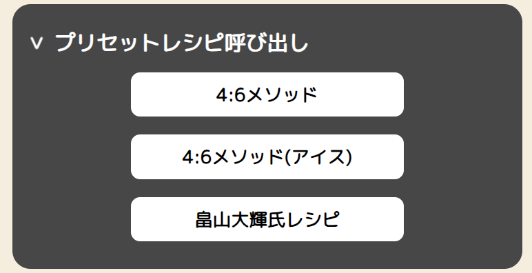
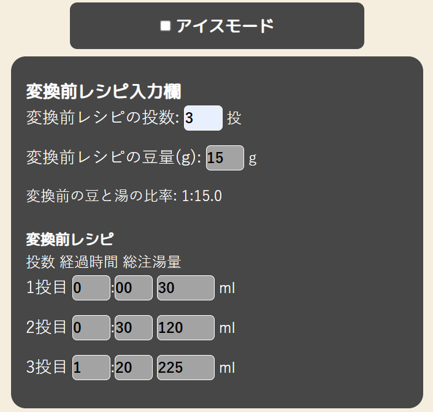
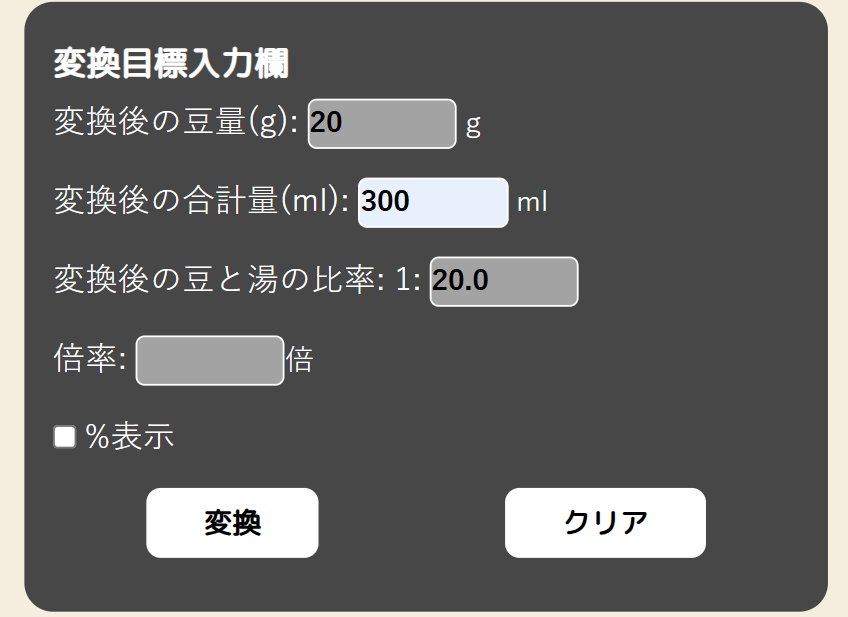
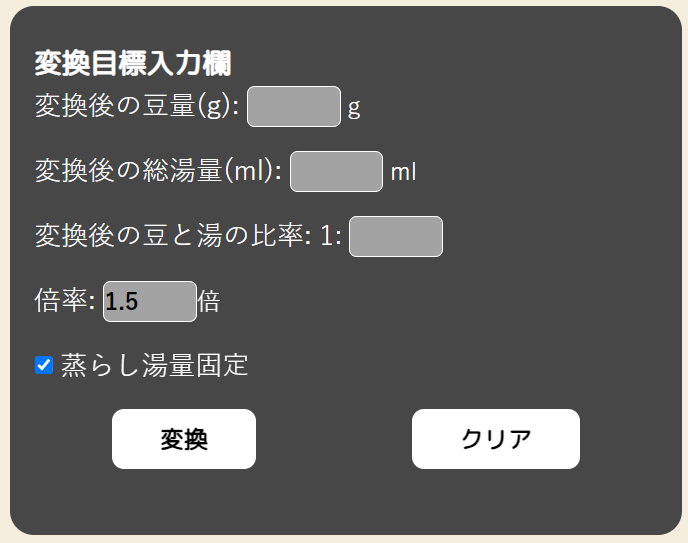
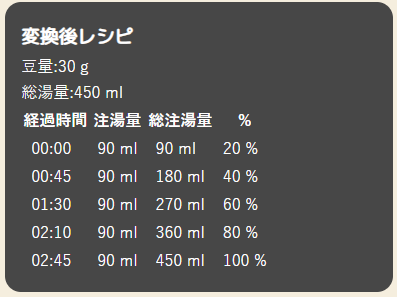
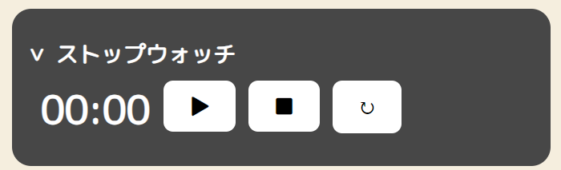
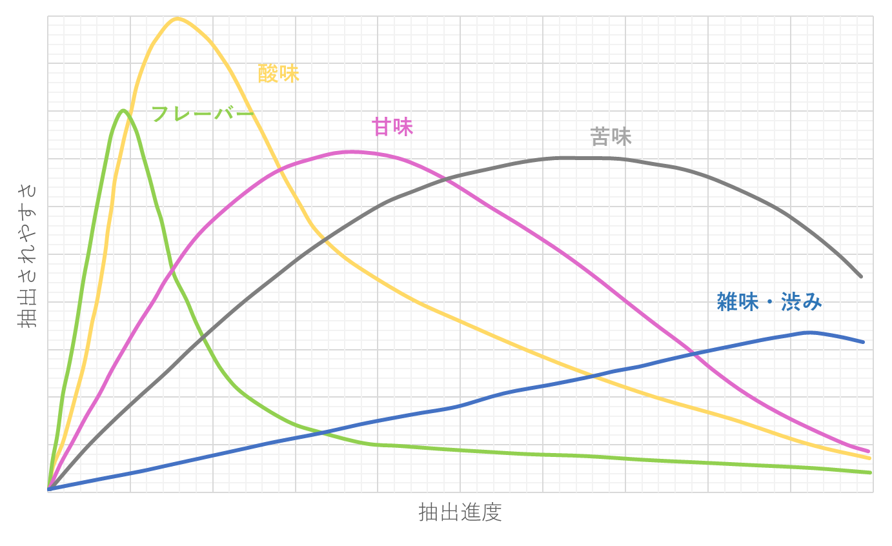

# プロジェクト概要:Co-fitting

コーヒーの味を維持したまま、出来上がり量を変化させる変換器です。

## 使用技術一覧
<!-- シールド一覧 -->

  
  
  
  
  

## 目次

1. [作成の経緯](#作成の経緯)
2. [主な機能と背景知識](#主な機能と背景知識)
3. [使用方法](#使用方法)
4. [既知の問題](#既知の問題)
5. [不具合等](#不具合等)

## 作成の経緯

「美味しいいれ方はあるんだけど、200mlじゃなくて300ml作りたいんだよな...」ということがしばしばあり、手軽に量の変換ができるツールがあれば便利だと思ったので作りました。
最終的なツールは[Webアプリ](https://co-fitting.com)として公開しています。

## 使用方法

基本原理や使用技術について述べる前に、使用方法について説明をしておきます。
[使い方ページ](https://co-fitting.com/how-to-use)にも同様の以下の説明と同様の内容が書いてあります。
本リポジトリのコードを基とするWebアプリは、([Co-fitting](https://co-fitting.com))で公開しています。

### デモ映像

https://github.com/user-attachments/assets/82e14817-657c-4947-9a74-a3a9b8c26b60

1. **プリセットレシピ呼び出しボタン**：登録されているプリセットレシピを呼び出します。

   

  利用したいものがあれば、登録されているプリセットレシピを呼び出します。
  プリセットレシピは、後述する「変換前レシピ入力欄」に自動的に入力されます。
  3つの「デフォルトプリセットレシピ」はユーザー登録無しで使えますが、ユーザー登録して自分だけのプリセットレシピを登録すると、それらも呼び出すことができます！

2. **変換前レシピ入力欄**：変換する前のレシピの情報を入力します。

   

   投数、豆の量、そして各投入段階の経過時間と注湯量を記入します。 
      ※ 投数を入力すると、その分だけレシピ入力欄が生成されます。 
   アイスコーヒーを入れたい場合は、アイスモードをONにし、氷量を入力します。

   

4. **変換目標入力欄**：変換後のレシピの情報を入力します。

   

   目標とする豆の量、総湯量、そして豆と湯の比率を指定します。

   **倍率変換**

     変換目標の入力が手間かと思い、倍率を入力するだけで変換できる機能を実装しました

      

   **入力補助**

     豆量と総湯量の両方が入力されると自動的に比率が計算・入力されます。 
     また、豆量あるいは総湯量のいずれかが入力された状態で比率が入力されると、もう一方が更新されます。 
     クリアボタンを押すと、変換目標入力欄の値が全てクリアされます。

      ※ 入力補助機能がある都合上、豆量・総湯量・比率が全て入力されていると目標値の変更が難しくなる問題を確認したため本機能を実装しました。

   **蒸らし固定ボタン**

      蒸らし湯量を固定した状態での変換が可能です。 
      基本的にはOFFで良いと思いますが、大幅な最終量変化がある場合は固定OFFでも良いかも知れません

5. **変換後レシピの出力**：変換されたレシピが表形式で表示されます。

      

6. **ストップウォッチ機能**：抽出時の経過時間を計測する機能です。

   

   スタートボタンを押すと計測が始まり、ストップボタンを押すと計測が終了します。

## 主な機能と背景知識

このCo-fittingの主な機能は3つです
- 量の変換機能
- マイプリセットの登録機能
- 課金によるプリセット枠増枠

### 量の変換機能
これは「コーヒーの味を維持しながら出来上がり量を変化させる」という処理を行う、本ツールのメイン部分です。ちなみに、この変換器が行っている変換処理の根幹は、「変換前と変換後の最終量から倍率を求め、各注湯プロセスに倍率をかける」という単純な比率変換です。
そのため変換には複雑な処理を必要とせず、HTML･CSSとJavaScript(jQuery)のみで実現されています。

#### Tips:単純な比率変換が味のキープに結び付く理由

ここでは、「この比率変換がなぜ味のキープにつながるのか」という点について述べます(コーヒー自体の理論に興味がない方は本節を読み飛ばしても大丈夫です)。

単純な比率変換が味のキープに結びつく理由

  
### 前提となる基本原理：成分が溶け出す順番

まず、コーヒーの粉から溶け出す成分には、「溶け出す順番」というものがあります。

抽出の際には湯を注ぐので、親水性のものから疎水性のものという順番で溶け出してくるというわけです。

しかし溶け出す成分の種類はとても多く、それら一つ一つを特定してコントロールするということはほぼ不可能に近いです。

ですが、この溶け出す順番には経験則的にいわれているある程度の大まかな流れがあります。それは、 **「香り→酸味→甘み→苦味→雑味」** の順に溶け出すという流れです。下図のように、溶け出しやすさのピークがこの順番に来るというイメージですね。

そこで、図をもとに「抽出をどの程度進めるか」によって、大まかなコーヒーの味を調整することができるのです。

これは本変換器を利用しない場合にも有効な基本原理なので、ぜひ自分でコーヒーを淹れる際にも意識し、湯温や粉の粒度などを調整してみてください。

  

※ 上図は[Kenken Coffeeさんの動画](https://youtu.be/lg7bafltXsk?si=rhBRmGLMRcgXcitu&t=848)に登場したものを参考に作成

### 本ツールにおける基本原理の応用

本変換器が行っていることは、単純な比率変換です。
本節では、その単純な比率変換が味のキープに結びつく理由について説明します。

さて、本ツールを理解する上で重要なのは、 **「どの味をどれだけ抽出するか」** という点です。

先ほど述べた通り、コーヒーの味は「香り→酸味→甘み→苦味→雑味」という順番で溶け出してくるとされています。

この順番を踏まえると、例えば「甘み」が出やすい時点で大量に湯を注げば、甘味成分の多いコーヒーが全体量中の多くを占め、その後段階で出てくるはずの苦味は少なく、酸味や甘みの多いコーヒーになります。
一方、「苦味」の時点で大量に湯を注げば、甘みの割合が比較的少なくなって甘みを感じにくくなります。

つまり本ツールでは、元レシピにおける各タイミングでの注湯配分を維持することで、「どの味が出やすい(割合が大きい)タイミングで」「全体量のどれだけを占める分注ぐのか」を維持し、コーヒー成分のバランス(=味)を保っているというわけです。

余談ですが、これは前節でも述べたように、本来「抽出をどの程度進めるかによって、大まかな味を決定できる」という話であり、このツールではその理論を本来とは異なる形で利用しています。
その点に注意して、このページの説明を理解していただければと思います。

### マイプリセットの登録機能
「マイプリセットの登録機能」は、変換元レシピを各々が登録しておき、簡単に呼び出せるようにするための機能です。ユーザー登録をしていただき、マイプリセット登録することで、変換元レシピ入力時と同様のUIからマイプリセットを呼び出せます。
これは<b>変換を行う際</b>にも、<b>普段のコーヒーレシピのメモ</b>にも便利かと思います。
この部分はバックエンド処理も必要だったので、Djangoを使っています。

### 課金によるプリセット枠増枠
最後に、3つ目の「課金によるプリセット枠増枠」について説明します。まず本サービスの仕様として、ユーザーが新規登録をすると、<b>マイプリセット枠</b>というものが1つ配布されます。ユーザーはこのマイプリセット枠の上限を超えてプリセット登録を行うことはできません。
そして「もっとプリセットを登録したい」という場合には、月額100円でプリセット枠を3枠増枠(つまり合計4枠に)することができます。
この課金機能の実装には、Stripeが使われています。

## 既知の問題

### 湯の抜け
  
この変換器では、豆量変化による流速(湯の抜け)の変化が加味されていません。単純な比率変換であることを理解した上で、変換結果を参考にしてください。 
湯の抜けが考慮されていないため、投数が少ない(3投以下)とかなり無理のあるレシピになってしまうことがあります。投数の多いレシピでお試しください。

なお、この問題に対する改善を検討中ですが、現在具体的な改善の目処は立っていません。

## 実装予定の機能

### 高度な変換機能

変換倍率に応じて、注湯タイミングの時間を引き延ばしたり、雑味を軽減するために最終湯量の割合を減らすなど、より高度な変換ができる機能を実装予定です。
  
## 不具合等

バグ修正等は[Googleフォーム](https://docs.google.com/forms/d/e/1FAIpQLSfV0YJ6VBoIUsFkAkiktcJMfc2jZRZ9aRZmbi-_JdEmUK2uIA/viewform)か、GitHubの[issue](https://github.com/Hiru-ge/Co-fitting/issues)まで連絡をお願いします！
